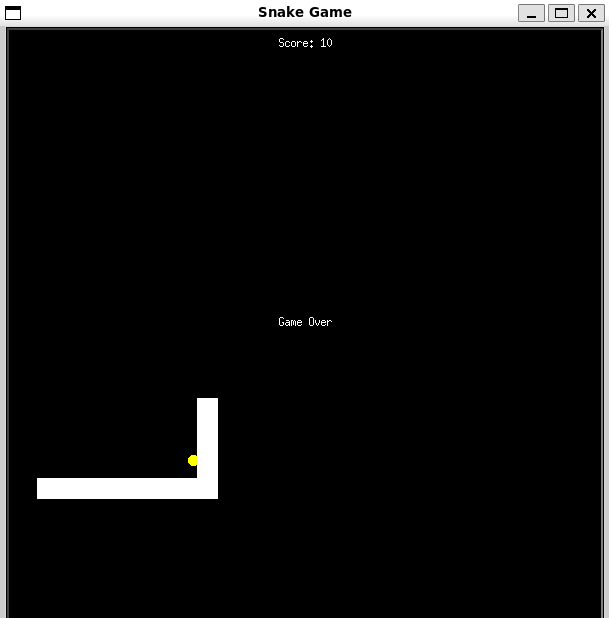

# SNAKE GAME
This is a classic snake game built using the built-in Python turtle library.



# PROJECT STRUCTURE

snake-game/
├──.venv
├── __pycache__/
├──.gitignore
├──.python-version
├── constants.py
├── food.py
├── main.py
├── pyproject.toml
├── README.md
├── scoreboard.py
├── snake.py
└── uv.lock


## TECHNOLOGIES USED
- Python
- Pygame
- uv (Python package and project manager)

# HOW TO RUN:
*Clone the repository*:

```bash
git clone https://github.com/kebba-philip/snake-game.git
cd snake-game
```

# INSTALL DEPENDENCIES
Make sure you have `Python` and `uv` installed, then run:
`uv sync`

## PLAY GAME
Run: `uv run main.py`  or `python main.py`

## CONTROLS

| Key          | Action        |
| ------------ | ------------- |
| UP           | Turn Upwards  |
| DOWN         | Turn Downwards|
| RIGHT        | Turn Right    |
| LEFT         | Turn Left     |


**KEBBA NJIE**
- GitHub: [@kebba-philip](https://github.com/kebba-philip)
